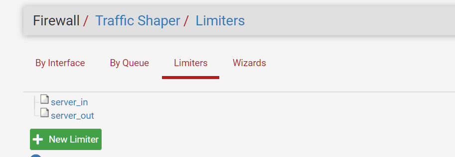
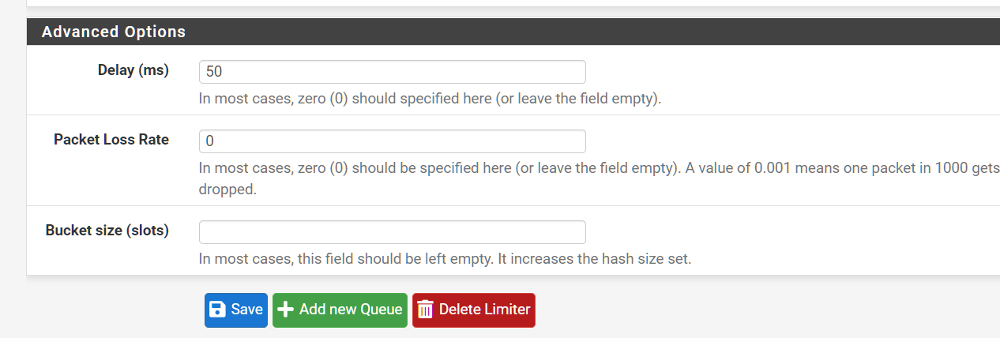
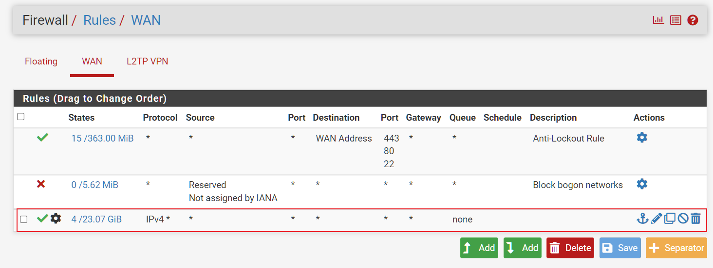
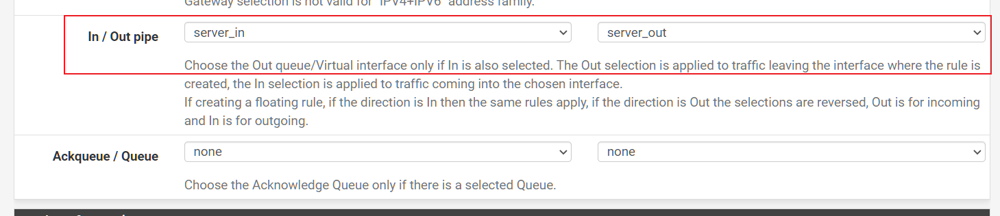

### pfsense模拟信道测速iperf3
**server client两端都需要安装好`iperf3`**

#### 下载软件
[release](https://github.com/lpc-v/netutil/releases)
#### 环境准备
##### server side
```shell
$ iperf3 -s -B yourIP -D                              # yourIP 换成需要测速的ip
```
在页面上创建两个Limiter, 并将两个limiter应用到防火墙





##### 上传脚本到服务器（server, client, 或者其它能连通都行）
```shell
cd ~ 
mkdir netutil && cd netutil
# ftp上传netutil到/~/netutil
# ftp上传config.ini到/~/netutil
mkdir input && cd input
# ftp上传tc.csv到/~/netutil/input
cd ..
mkdir out
```
##### conf.ini配置文件


**注意**
`pipein` `pipeout` 都加上100ms延时，实际效果就是200ms延时
`pipein` `pipeout` 都加上10%丢包，实际效果大约10% + 90% * 10% = 19%丢包